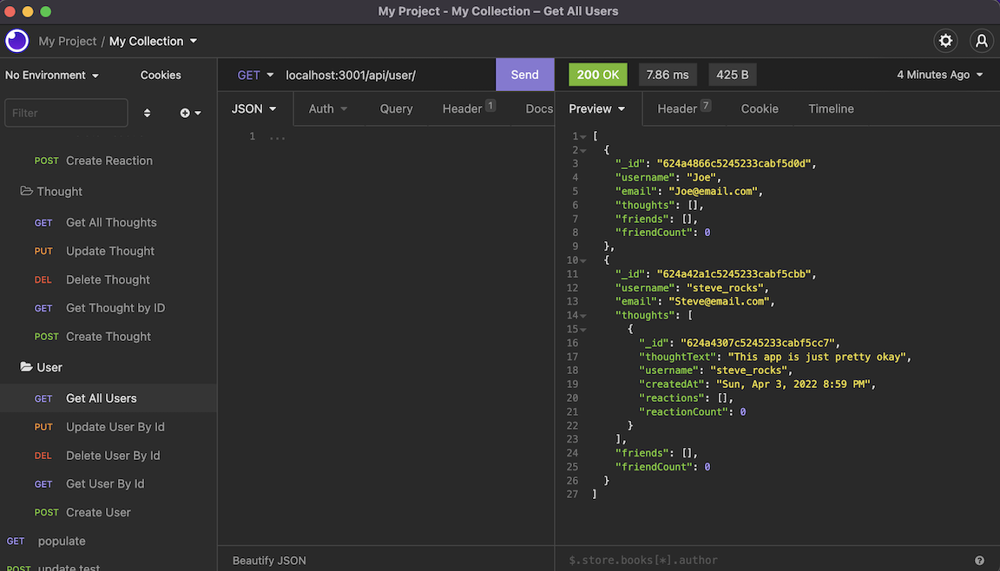
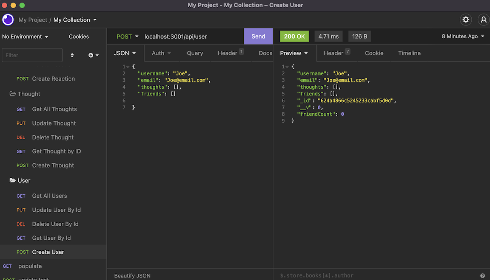
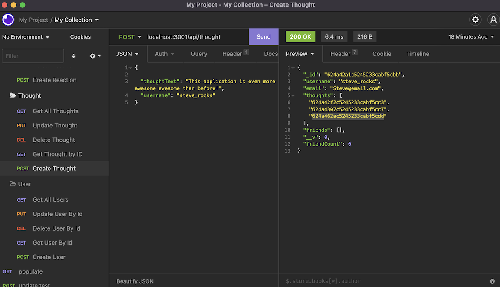

# Thoughts_On_This_Social_Network_API
  
## Description 

  
An API for a social network web application That creates Users, allows them to share Thoughts and React to those thoughts, and add each other to their friend lists. Uses Express.js for routing, MongoDB for the database, and Mongoose as the ODM. Day.js is an included Javascript library that formats the dates used on the website. 

## Table of Contents
* [Installation](#Installation)
* [Usage](#Usage)
* [License](#License)
* [Questions](#Questions)
* [Walkthrough](#Walkthrough)

## Installation
Clone this repository to your computer. Navigate to the root folder then run `npm init` or `npm init -y`. Then run either `npm i` or `npm install` to install the local dependencies

  
## Usage
Open a separate command line and start mysql with the command `mongo`, then `use social_network_api` to ensure you are using the database for this application. Begin the application by running the command `node server.js` or `npm start`. Then you may exit mysql. If you wish to seed the database, use the command `node seeds/index.js`. To start the application, use `node server.js`. Use an API client, such as insomnia, to test and use the routes in this application

  

## License
A short and simple permissive license with conditions only requiring preservation of copyright and license notices. Licensed works, modifications, and larger works may be distributed under different terms and without source code.  

## Questions
If you have any questions, concerns, or comments, feel free to contact me:
  
-GitHub: [Zacharycampanelli](https://github.com/Zacharycampanelli)  
-Email: [zaccamp@optonline.net](mailto:zaccamp@optonline.net)

## Video Walkthough
-[Part 1](https://drive.google.com/file/d/1CN4MUx8bwxUym5NbYwQrr968ZX-biK04/view)  
-[Part 2](https://drive.google.com/file/d/1-J1Ogt91PrwKsotD24QIQDhC0cpHyToX/view)  
-[Part 3](https://drive.google.com/file/d/1ZYqBl8e3ciwWaVF3ez9tx9fAGY-1EnS2/view) 